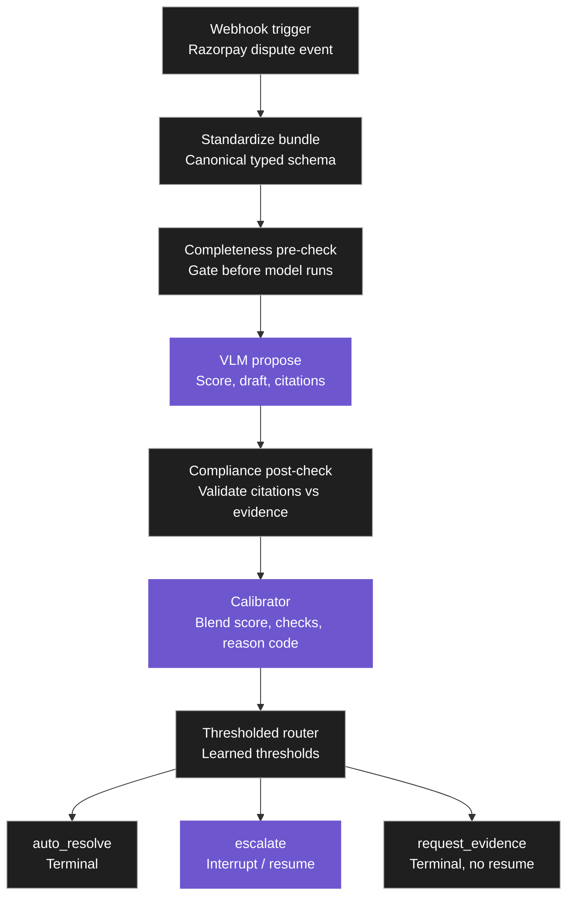

# Pramaan (प्रमाण) — AI Dispute Evidence Auditor

Multi-modal chargeback/dispute evidence auditor. A vision-language model proposes a validity score and draft response from transaction + delivery evidence, deterministic guardrails check completeness and citation compliance, a calibrated gradient-boosting model blends everything into one score, and a thresholded router sends each case to auto-resolve, human review, or request-more-evidence.

## Pipeline



1. **Webhook trigger** — Razorpay's real `payment.dispute.created` event shape, auto-populating dispute metadata.
2. **Standardize into evidence bundle** — raw payload normalized into a canonical typed schema. Any raw free text is quarantined here; the guardrail and calibrator downstream never touch it directly.
3. **Completeness pre-check** — deterministic gate. Missing required evidence for a given reason code short-circuits straight to `request_evidence` without ever calling the model.
4. **VLM propose** — the only stage that calls an LLM. Returns a validity score, a draft response, and citations back to specific evidence fields.
5. **Compliance post-check** — deterministic gate verifying every citation the model returned actually resolves against a real field in the evidence bundle (no hallucinated citations pass silently).
6. **Calibrator** — gradient-boosted model blending VLM score, guardrail pass/fail, citation count, and reason code into one calibrated probability.
7. **Thresholded router** — three-way decision. `escalate` is the only branch with a resume path: it pauses on a LangGraph `interrupt()`, ahuman reviews the case out-of-band, and the case resumes via `Command(resume=...)` carrying human's approve/reject decision. `request_evidence` is a deliberate dead end, not an oversight, there is currently no resume path for it.

Every stage writes to an audit trail through two separate mechanisms: the LangGraph `SqliteSaver` checkpointer persists full pipeline state at each node (this is what makes `interrupt()`/resume possible at all), and a generic wrapper applied to every node additionally writes a human-readable row per stage to a SQL `audit_log` table — this second one is what the API/frontend actually read to render a case's timeline. Both are written by hand at the API layer and are not automatically kept in sync with each other if a new terminal state is ever added.

## Tech stack, and why

| Layer            | Choice                                                                                                     | Reasoning                                                                                                                                                                                                                                                                                                                                                                                                                                                                                                                                                                                                                                                                                                                                                                                                                                                                             |
| ---------------- | ---------------------------------------------------------------------------------------------------------- | ------------------------------------------------------------------------------------------------------------------------------------------------------------------------------------------------------------------------------------------------------------------------------------------------------------------------------------------------------------------------------------------------------------------------------------------------------------------------------------------------------------------------------------------------------------------------------------------------------------------------------------------------------------------------------------------------------------------------------------------------------------------------------------------------------------------------------------------------------------------------------------- |
| Orchestration    | LangGraph                                                                                                  | Three genuine conditional gates (pre-check, post-check, router) match LangGraph's conditional-edges model structurally. The checkpointer gives resumable state almost for free, and the escalate branch is a real interrupt-and-resume problem that`interrupt()` handles as a first-class pattern — a plain state machine would mean hand-building a queue, a wait-state, and a resume mechanism from scratch.                                                                                                                                                                                                                                                                                                                                                                                                                                                                     |
| LLM/VLM provider | LiteLLM abstraction layer, Groq as the model underneath                                                    | Originally planned around Gemini's free tier, switched to Groq mid-build after`gemini-1.5-flash` started returning 404 on the free tier. Because the design always went through LiteLLM rather than calling a provider SDK directly, this was a model-string-and-API-key change, not a business-logic change — the app-specific wrapper (`propose_evidence_review(bundle) -> ProposalOutput`) enforces a Pydantic output schema regardless of which provider actually answered. Multi-key rotation with retry/backoff on rate-limit errors was added once free-tier limits became a real constraint during development.                                                                                                                                                                                                                                                          |
| Calibrator       | Scikit-learn`GradientBoostingClassifier` (shallow trees, depth 2–3) + `CalibratedClassifierCV` + SHAP | With only ~216 cases across five reason codes, logistic regression can't express the conditional relationships the calibrator needs to capture, and a small neural net would overfit a dataset this size for no benefit. SHAP gives per-case explanations that are a stronger audit-trail artifact than raw coefficients — you can show exactly why one case's score moved, not just that it did. Router thresholds are*learned*, not hand-set: an initial hand-picked pair (0.8 auto-resolve / 0.4 escalate) turned out unreachable once real calibrated scores came in (max observed was 0.648), so the training script now computes both thresholds itself from out-of-fold calibrated-score percentiles (p90 for auto-resolve, p50 for escalate) and writes them to disk; the router loads that file at import time and only falls back to hardcoded defaults if it's missing. |
| Backend          | FastAPI                                                                                                    | Serves the frontend and runs the LangGraph pipeline.                                                                                                                                                                                                                                                                                                                                                                                                                                                                                                                                                                                                                                                                                                                                                                                                                                  |
| Frontend         | Next.js/React                                                                                              | Judge-facing demo, chosen over Streamlit for polish given the extra build time was available.                                                                                                                                                                                                                                                                                                                                                                                                                                                                                                                                                                                                                                                                                                                                                                                         |
| Storage          | SQLite                                                                                                     | Switched from an original Postgres plan for zero setup/connection overhead against a 48-hour deadline. SQLAlchemy abstracts the database layer to a single connection-string difference, so a future Postgres migration is mechanical, not a rewrite.                                                                                                                                                                                                                                                                                                                                                                                                                                                                                                                                                                                                                                 |

## Data

Real UPI Transactions 2024 and Delivery Logistics India Multi-Partner
datasets (both from Kaggle — synthetically generated with realistic
distributions, not live transaction data). Dispute *labels* on top of that
real transaction/delivery data are synthetic, since no public dataset of
real chargeback outcomes exists anywhere; the label-generation thresholds
are grounded in published India COD/RTO return-rate and fraud-rate
statistics rather than picked arbitrarily. `duplicate_charge` and
`unauthorized_transaction` carry near-zero positive labels by design —
this matches the real published fraud base rate (~0.2%), so the calibrator
gets very little learnable signal for those two reason codes specifically.
This is a known, stated limitation of the synthetic dataset, not a bug to
keep chasing.

A Hindi/Hinglish handling stance is architectural from day one (the typed
schema in the standardize stage means the guardrail and calibrator never
touch raw free text), but the actual dataset/eval work for it
(SentiMix + HingBERT-LID as a validation set) was deliberately deferred
past the hackathon deadline as a phase-two item.

## Running it

Two processes, each run from its own directory — paths in the code are
relative to each, so `cd` in before running rather than running from repo
root.

```bash
# backend
cd backend
python3 -m venv ../venv && source ../venv/bin/activate
pip install -r requirements.txt
uvicorn app.main:app --reload --port 8000
# -> http://127.0.0.1:8000/health should return {"status":"ok"}

# frontend, separate terminal
cd frontend
npm install
npm run dev
# -> http://localhost:3000
```

`backend/.env` (not committed) needs:

```env
LLM_MODEL=groq/<model-name>
LLM_API_KEY=key1,key2,key3   # comma-separated, rotates through all on rate-limit
```

One setup trap worth knowing: `python-dotenv`'s `load_dotenv()` only reads a
file literally named `.env` — a file named anything else (`_env`, `env.txt`,
etc.) will silently fail to load with no error, just missing config.

Calibrator artifacts (`calibrator.joblib`, `thresholds.json`) are committed
to the repo on purpose, not gitignored — a fresh clone has a working,
already-trained calibrator immediately without needing to run the training
script first. Retrain manually (`python -m app.calibrator.train` from
`backend/`) any time the underlying dataset changes.

Tests:

```bash
cd backend && source ../venv/bin/activate && python -m pytest tests/ -v
```

Test coverage focuses on the parts that broke silently during development —
the citation-resolution logic in the compliance guardrail (which force-
escalated every single case, twice, before the bug was caught and fixed) and
the case-status mapping between a router's decision and a human's resume
action. The calibrator's training script is verified manually via its own
printed cross-validation score and threshold output rather than an
automated test.

## Known limitations

- No authentication on any endpoint — acceptable for a hackathon demo, not
  for anything beyond it.
- `request_evidence` has no resume path; only `escalate` reaches human
  review.
- All dispute-validity labels are synthetic, grounded in published
  statistics rather than real dispute outcomes, since no public dataset of
  real outcomes exists — every metric here measures the pipeline's internal
  consistency, not real-world accuracy against live merchant traffic.
- `REASON_CODES` (`item_not_received`, `not_as_described`,
  `duplicate_charge`, `unauthorized_transaction`, `defective_product`) is
  duplicated as a literal list across three separate calibrator files —
  nothing currently enforces keeping them in sync if a reason code is added
  or removed.
- A guardrails module exists in the codebase but is unused — the actual
  completeness and compliance logic it was meant to hold lives directly
  inside the relevant pipeline node files instead.
